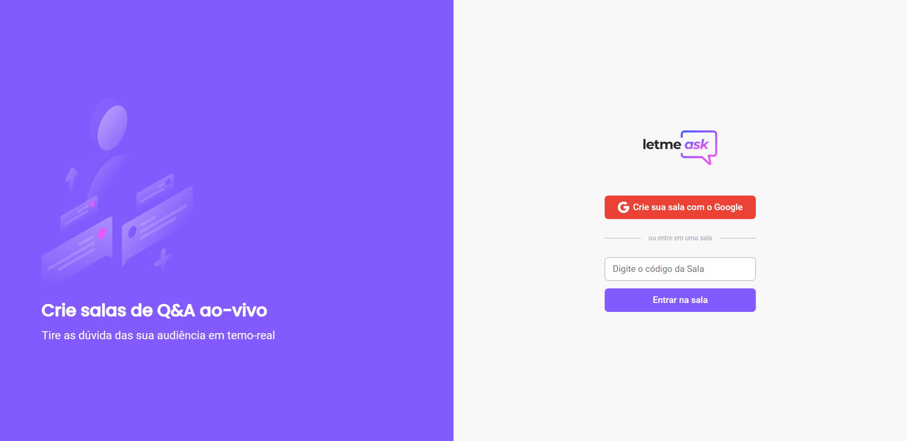

<p align="center">
  
</p>

<h1 align="center">
    
</h1>

<br/>

## 🔨 Tecnologias

Esse projeto foi desenvolvido com as seguintes tecnologias:

- [React](https://reactjs.org)
- [Firebase](https://firebase.google.com/)
- [TypeScript](https://www.typescriptlang.org/)

## 🧭 Como executar o projeto

Clone o repositório e navegue até o mesmo.
```bash
git clone https://github.com/Gustingg/LetMeAsk-NLW.git

cd LetMeAsk-NLW
```

Para executa-lo:
```bash
# Instalar as dependências
yarn

# Iniciar o projeto
yarn start
```

O app estará disponível para testar pelo seu browser no endereço http://localhost:3000

⚠️ O banco atual é de minha autoria, e